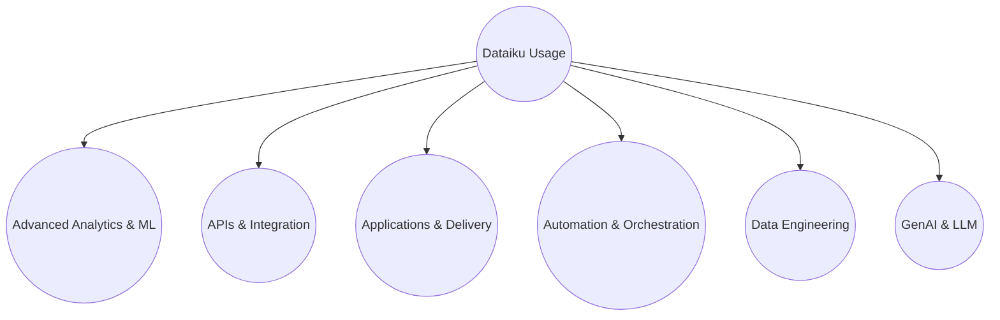
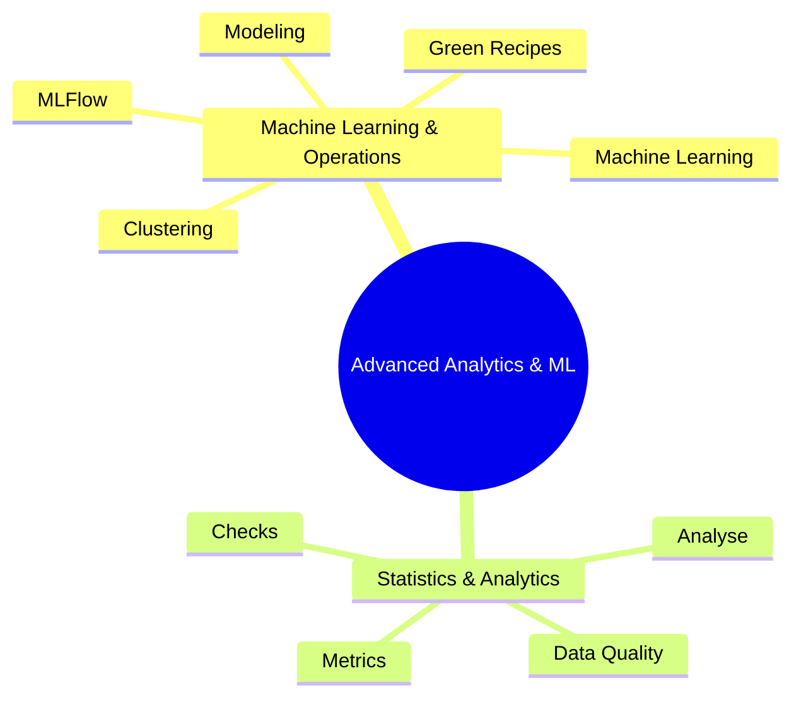
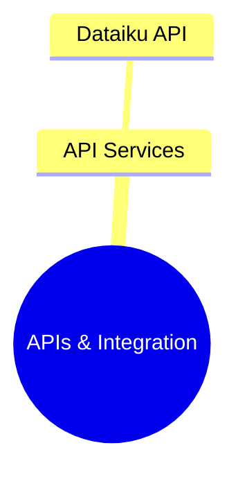
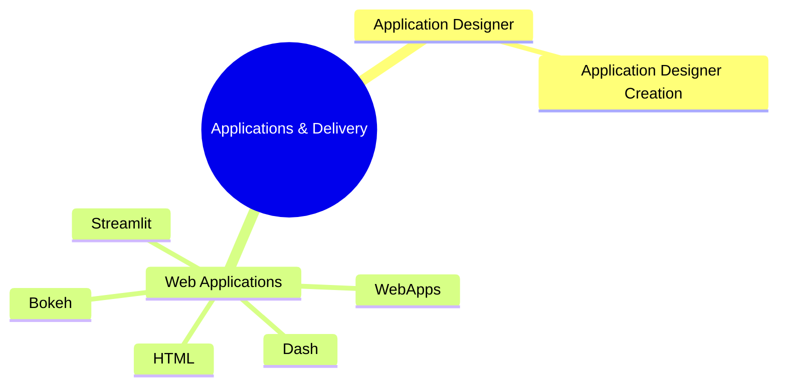
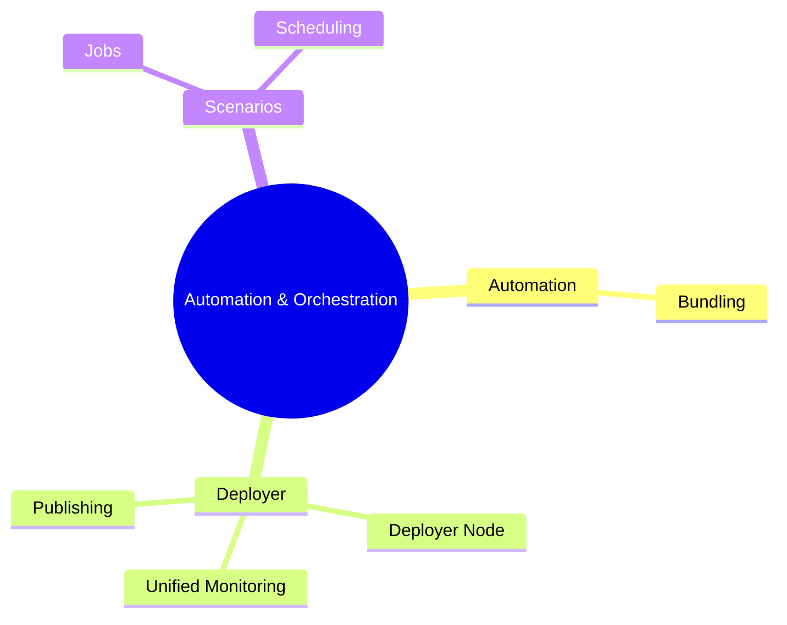
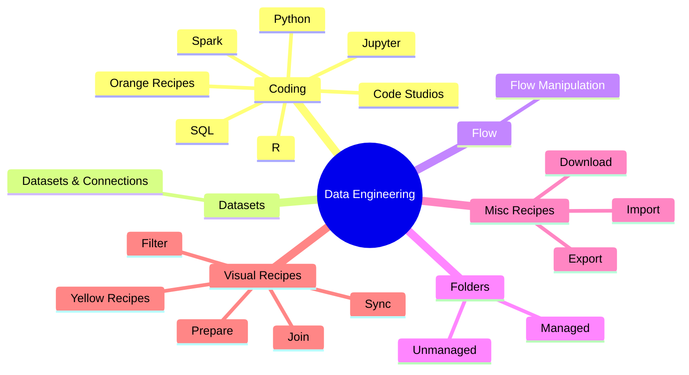
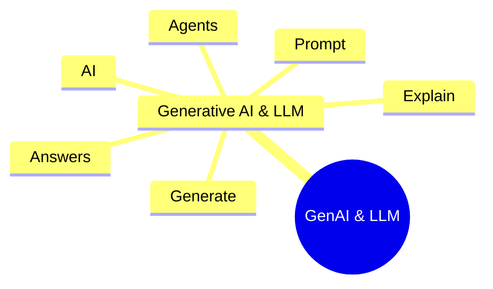

# Dataiku Usage Overview

This document describes how platform usage is categorized and reported
within the Dataiku Pulse project.

The diagram below shows how hig◊h-level Dataiku capabilities are grouped
and how individual usage categories roll up into those capabilities.

---

## Usage Taxonomy Diagram

## Advanced Analytics & ML

Short explanation of what this capability represents and how usage is counted.

## APIs & Integration

Short explanation of what this capability represents and how usage is counted.

## Applications & Delivery

Short explanation of what this capability represents and how usage is counted.

## Automation & Orchestration

Short explanation of what this capability represents and how usage is counted.

## Data Engineering

Short explanation of what this capability represents and how usage is counted.

## GenAI & LLM

Short explanation of what this capability represents and how usage is counted.

