# Dataiku Usage Overview

This document describes how platform usage is categorized and reported
within the Dataiku Pulse project.

The diagram below shows how hig◊h-level Dataiku capabilities are grouped
and how individual usage categories roll up into those capabilities.

---

## Usage Taxonomy Diagram

```mermaid
graph TD
    %% Top Layer
    U((Dataiku Usage))

    %% Dataiku Capabilities
    U --> ML((Advanced Analytics & ML))
    U --> API((APIs & Integration))
    U --> AD((Applications & Delivery))
    U --> AO((Automation & Orchestration))
    U --> DE((Data Engineering))
    U --> GEN((GenAI & LLM))

    %% Dataiku Categories
    ML --> ML1[Machine Learning & Operations]
        ML1 --> SUBML1[MLFlow, Machine Learning, Modeling, Clustering<br/>Green Recipes]
    ML --> ML2[Statistics & Analytics]
        ML2 --> SUBML2[Data Quality, Metrics, Checks, Analyse]

    API --> API1[APIs Services]
        API1 --> SUBAPI1[Dataiku API]

    AD --> AD1[Application Designer]
        AD1 --> SUBAD1[Dataiku Application Designer Creation]
    AD --> AD2[Web Applications]
        AD2 --> SUBAD2[WebApps: Bokeh, Dash, HTML, Streamlit, etc.]

    AO --> AO1[Automation]
        AD1 --> SUBAD1[Bundling]
    AO --> AO2[Deployer]
        AO2 --> SUBAO2[Deployer Node, Unified Monitoring, Publishing]
    AO --> AO3[Scenarios]
        AO2 --> SUBAO3[Jobs, Scenarios, Scheduling]

    DE --> DE1[Coding]
        DE1 --> SUBDE1[Python, R, SQL, Spark, Jupyter, Code Studios<br/>Orange Recipes]
    DE --> DE2[Datasets]
        DE2 --> SUBDE2[Dataiku Datasets & Connections]
    DE --> DE3[Flow]
        DE3 --> SUBDE3[Dataiku Flow Manipulation]
    DE --> DE4[Folders]
        DE4 --> SUBDE4[Dataiku Folders Managed & Unmanaged]
    DE --> DE5[Misc Recipes]
        DE5 --> SUBDE5[Download, Export, Import]
    DE --> DE6[Visual Recipes]
        DE6 --> SUBDE6[Sync, Prepare, Join, Filter, etc.<br/>Yellow Recipes]

    GEN --> GEN1[Generative AI & LLM]
        GEN1 --> SUBGEN1[AI, Prompt, Answers, Agents, Explain, Generate]
```

