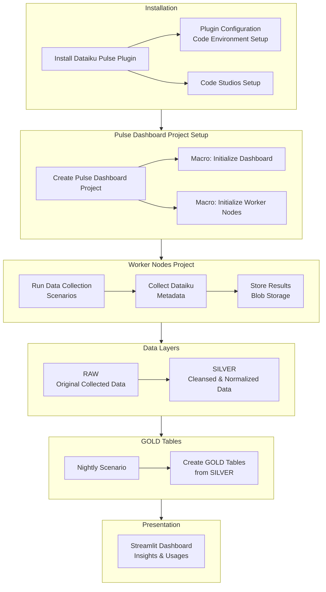

# Dataiku Pulse - Process Flow

```mermaid

flowchart TD

    %% =========================
    %% Installation
    %% =========================
    subgraph INSTALL[Installation]
        A[Install Dataiku Pulse Plugin]
        A1[Plugin Configuration<br/>Code Environment Setup]
        A2[Code Studios Setup]

        A --> A1
        A --> A2
    end

    %% =========================
    %% Dashboard Initialization
    %% =========================
    subgraph DASH_INIT[Pulse Dashboard Project Setup]
        B[Create Pulse Dashboard Project]
        B1[Macro: Initialize Dashboard]
        B2[Macro: Initialize Worker Nodes]

        B --> B1
        B --> B2
    end

    %% =========================
    %% Worker Nodes
    %% =========================
    subgraph WORKER[Worker Nodes Project]
        C1[Run Data Collection<br/>Scenarios]
        C2[Collect Dataiku<br/>Metadata]
        C3[Store Results<br/>Blob Storage]

        C1 --> C2 --> C3
    end

    %% =========================
    %% Data Layers
    %% =========================
    subgraph STORAGE[Data Layers]
        D1[RAW<br/>Original Collected Data]
        D2[SILVER<br/>Cleansed & Normalized Data]

        D1 --> D2
    end

    %% =========================
    %% GOLD Creation
    %% =========================
    subgraph GOLD[GOLD Tables]
        E1[Nightly Scenario]
        E2[Create GOLD Tables<br/>from SILVER]

        E1 --> E2
    end

    %% =========================
    %% Streamlit Dashboard
    %% =========================
    subgraph STREAMLIT[Presentation]
        F[Streamlit Dashboard<br/>Insights & Usages]
    end

    %% =========================
    %% Flow Connections
    %% =========================
    INSTALL --> DASH_INIT
    DASH_INIT --> WORKER
    WORKER --> STORAGE
    STORAGE --> GOLD
    GOLD --> STREAMLIT

```
