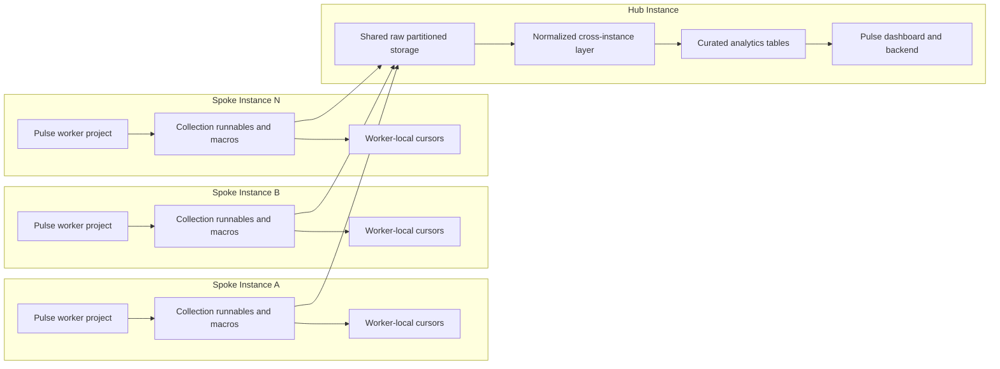

# Architecture

Pulse v3 is designed around a **hub-and-spoke operating model** for Dataiku fleets.

Instead of treating every Dataiku instance as an isolated deployment, Pulse organizes the platform into:

- a **Hub** that centralizes storage, modeling, and dashboard consumption
- one or more **Spokes** that collect metadata and usage signals from individual Dataiku instances

This pattern lets organizations monitor a distributed Dataiku estate while keeping collection close to each source instance and keeping analytics centralized.

## Why Pulse Uses a Hub-and-Spoke Model

Large Dataiku environments rarely live on a single node. Teams often operate:

- multiple design nodes
- automation or API nodes
- separate business-unit instances
- region-specific or environment-specific DSS deployments

Pulse v3 treats each connected instance as a spoke in a broader observability system.

The model provides a clear separation of concerns:

- **Spokes collect**: each instance is responsible for extracting its own local metadata, audit signals, and operational footprints
- **The hub consolidates**: the central Pulse deployment receives normalized outputs from all spokes
- **The hub models**: shared transformations produce curated analytics-ready tables
- **The hub serves**: dashboards and downstream queries read from a unified cross-instance analytics layer

This gives Pulse a scalable operating shape: collection remains distributed, while reporting and governance remain centralized.

## Conceptual Topology

## Core Roles

### The Hub

The hub is the central Pulse control plane and analytics plane.

It is responsible for:

- receiving collected outputs from all connected spokes
- storing partitioned raw or near-raw collection artifacts in shared managed storage
- normalizing cross-instance datasets into a consistent analytical structure
- building curated GOLD tables for dashboard consumption
- serving the Pulse dashboard experience

In practice, the hub contains the shared storage location, the transformation logic, and the web-facing analytics layer.

### The Spokes

Each spoke is a Pulse-enabled Dataiku instance that contributes operational data to the hub.

A spoke is responsible for:

- running collection logic against its own local DSS APIs and metadata surfaces
- extracting datasets such as project metadata, object metadata, audit events, and user activity
- maintaining its own local incremental state where needed
- publishing collection outputs to the hub’s shared storage target

A spoke does **not** need to host the centralized dashboard or consolidated analytics model. Its role is targeted: collect locally, send centrally.

## Logical Data Flow

Pulse v3 follows a layered flow from collection to visualization.

### 1. Local collection on each spoke

Collection starts on the spoke instance.

Pulse runnables or macros execute within a worker project on that instance and gather information from local DSS services. This keeps extraction close to the source system and avoids asking the hub to directly perform every operational read against every node.

Examples of collected domains include:

- project and recipe metadata
- datasets and scenarios metadata
- user activity and login behavior
- audit and usage logs
- selected infrastructure or footprint signals

### 2. Incremental state stays with the spoke

Where collection is incremental, the cursor belongs to the worker side.

That is an important architectural decision in Pulse:

- each spoke keeps track of its own collection progress
- cursor variables are stored in the worker project
- incremental collection remains independent across instances

This prevents different instances from overwriting each other’s progress and supports safe multi-instance operation.

### 3. Raw outputs land in hub-managed shared storage

After collection, each spoke uploads its outputs to the hub-side storage area.

This storage acts as the ingestion boundary between distributed collection and centralized modeling. At this stage, data is organized so the hub can process multiple instances consistently and preserve instance-level provenance.

### 4. The hub normalizes data into a shared analytical structure

Once data lands centrally, hub-side processing transforms it into a normalized cross-instance layer.

This layer aligns schemas across collection domains and prepares the data for reusable analytics. It is the point where Pulse turns many instance-specific extracts into one coherent estate-wide model.

### 5. Curated GOLD tables power analytics and dashboards

The final transformation layer produces curated tables optimized for reporting and dashboard queries.

These GOLD datasets are where Pulse expresses its opinionated view of platform usage, adoption, governance, and activity. The dashboard backend queries this layer rather than querying raw collected files directly.

## Architectural Layers

Pulse v3 can be understood as four logical layers.

### Collection layer

Runs on each spoke and interacts with local DSS services.

Responsibilities:

- call local APIs and metadata endpoints
- fetch audit and activity signals
- serialize outputs in a reproducible structure
- manage local incremental cursors where applicable

### Ingestion layer

Bridges spokes and hub.

Responsibilities:

- receive uploaded artifacts from multiple instances
- preserve source-instance identity
- provide a stable boundary between extraction and modeling

### Modeling layer

Runs on the hub.

Responsibilities:

- standardize collected schemas
- reconcile cross-instance datasets
- build reusable curated tables for analytics
- support a scalable estate-wide reporting model

### Consumption layer

Serves end users from the hub.

Responsibilities:

- expose dashboards and application views
- answer product and governance questions consistently
- provide one place to understand fleet-wide platform usage

## Design Principles in v3

This v3 architecture reflects several deliberate design choices.

### Distributed collection, centralized insight

Pulse collects data where it is generated but analyzes it where a cross-instance view is needed.

This avoids forcing every analytic query to fan out live across multiple DSS instances while still preserving a unified observability experience.

### Instance autonomy

Each spoke manages its own collection lifecycle.

That matters operationally because Dataiku instances may not all run on the same cadence, carry the same data volume, or experience the same operational constraints.

### Clear separation between operational and analytical concerns

The spoke side focuses on extraction and delivery.
The hub side focuses on consolidation, modeling, and visualization.

This separation keeps responsibilities understandable and makes the architecture easier to operate and evolve.

### Centralized governance view

By converging data into a hub model, Pulse enables leadership, platform teams, and administrators to answer questions that are difficult to answer inside any single DSS instance, such as:

- which projects and users are active across the estate
- where adoption is growing or declining
- how usage patterns differ by instance or business unit
- which parts of the platform footprint matter most

## What Changes from Earlier Pulse Generations

Pulse v3 keeps the successful hub-and-spoke foundation from earlier versions, but frames it more explicitly as a product architecture rather than only an installation pattern.

Compared with earlier documentation, v3 emphasizes:

- a **central analytics hub** instead of a simple storage target
- **spoke-owned incremental collection state** for safer scaling
- a clearer distinction between **collection**, **normalization**, **curation**, and **dashboard consumption**
- a platform-wide observability vision rather than a set of disconnected ingestion jobs

In other words, the hub is not just where files land. It is where Pulse turns distributed operational exhaust into a coherent decision-support layer.

## Summary

Pulse v3 is built to support a distributed Dataiku ecosystem through a centralized product experience.

- **Spokes** run local collection on each Dataiku instance
- **The hub** receives and organizes those outputs
- **The hub modeling layer** transforms raw signals into reusable analytics tables
- **The dashboard** presents one unified view of the estate

That hub-and-spoke structure is what allows Pulse to scale from a single instance to a multi-instance Dataiku landscape without losing operational clarity.
