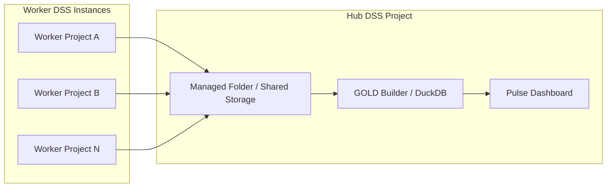

# Architecture

Placeholder for V3 architecture documentation.

## Hub and Spoke Diagram

This document should eventually describe:

- collection flow from workers
- normalization and GOLD build process
- dashboard consumption path
- hub/worker responsibilities
